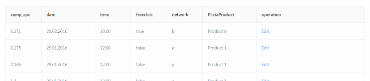

Editable table with react and [ant-design](https://ant.design/).  


URL: https://editabletable-react.netlify.com  
Source: https://github.com/antekai/ct-pl-editableTable-react  
Tags: Demo, Editable table, react app, ant design, coding task  
Date: 29 August - 1 September 2018  
Stack: React.js, ant-design

## Features

* Raw data preprocess and render to a table
* Inline edit and save per record(row): checkbox, select, datePicker, timePicker, radio input for respective data type
* State management: Local, Context API (react)
* UI-kit: [ant-design](https://ant.design/)
* Boostrapping: create-react-app, react-app-rewired
* Netlify CD

## Installation

Install [Node.js](https://nodejs.org/en/), [Git](https://git-scm.com/) and then:

```sh
git clone https://github.com/antekai/ct-pl-editableTable-react.git editableTable-react
cd editableTable-react
yarn install
yarn start
```

## Support

Please [open an issue](https://github.com/antekai/ct-pl-editableTable-react/issues/new) for support.
