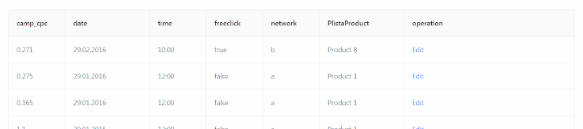

Editable table with [Angular 6](https://angular.io/) and [NG-ZORRO - Ant Design of Angular](https://ng.ant.design/docs/introduce/en).  


URL: https://editabletable-angular.netlify.com/  
Source: https://github.com/antekai/ct-pl-editableTable-angular  
Tags: Demo, Editable table, angular app, ng-zorro, coding task  
Date: 4-6 September 2018(v1), 13-15 September(v2)  
Stack: Angular 6, RxJS, TypeScript, ng-zorro

## Features

--v1 inline-edit --

* Raw data preprocess and render to a table
* Inline edit and save per record(row): number, checkbox, select, datePicker, timePicker, radio input for respective data type
* UI-kit: [ant-design](https://ant.design/)
* Template driven forms, validation
* Netlify CD

--v2 view-table --

* Different routes for view and edit table
* Firebase backend API setup and management
* Observables for http-requests to Firebase API
* Extra services for http-requests and routing, extra pipes for data manipulation
* Reactive Forms

## Installation

Install [Node.js](https://nodejs.org/en/), [Git](https://git-scm.com/) and then:

```sh
git clone https://github.com/antekai/ct-pl-editableTable-react.git editableTable-angular
cd editableTable-angular
npm install
ng serve -o
```
